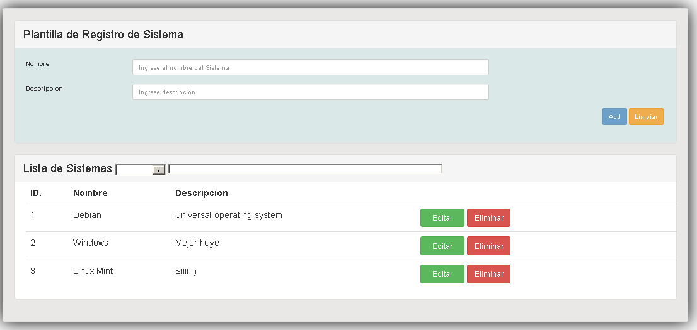
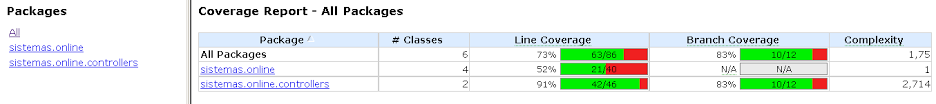
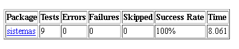

# Spring boot basic

## Objetivo

* Desarrollar una API rest CRUD que me permita crear, modificar, listar y eliminar Objetos del tipo “Sistema”.
* Crear una JSP que contenga un combo con los sistemas y al seleccionar uno invoque al servicio de la API rest anterior y retorne la información del mismo y se despliegue en un textarea

## Elección de Tecnologias

* Spring Boot, permite un rapido desarrollo de servicios REST (carga media: Threads).
* JPA, es el Standard de JAVA para persistencia. Se usa Base de Datos H2 por comodidad, si se desea otra simplemente configurar aplication.properties y bajar dependencias.
* Log4J2, SpringMock, SpringJUnit.  
* Por simplicidad se realizo dentro del mismo modulo la parte Rest y web. Se separo unicamente el model en otro modulo (MVC).
* Maven.
* Cobertura >20% (se hicieron solo Test Unitarios de la parte REST).

## Metodologia de desarrollo #

* Desarrollo Normal. Partiendo de los casos de uso, se sugiere usar TDD.

## Armado del ambiente

* Requerimientos: Java 1.8, maven 3.3+
  * Comandos:
    * git clone <https://github.com/PabloInnocenti/SpringBootBasic.git>
    * mvn clean package
    * Logs: sistemas.log

## Accediendo a la aplicacion

### Correr la aplicacion

* cd online
* mvn spring-boot:run

### Accediendo a la aplicación

* Para acceder a la aplicación: <http://localhost:9090>

### Micelaneous

* Para ver los datos en la base H2: <http://localhost:9090/console>
* Para el servicio REST: <http://localhost:9090/sistema/>
* Para pedir el primer registro por id: <http://localhost:9090/sistema/1>

## Medicion de Calidad y reportes

* Cobertura: mvn cobertura:cobertura --> online\target\site\cobertura

* JUnit: mvn surefire-report:report --> online\target\site\surefire-report.html

## Relevamiento de requerimientos: Casos de Uso

---

### Flujo principal: Listado de Sistemas

Actores:

* Usuario

Pre-condiciones:

* Sevidor aplicativo Tomcat ( modulo online: mvn spring-boot:run) corriendo.

a) Flujo Basico:

1. El usuario debe entrar a <http://localhost:9090/>

Post condiciones:

* El sistema deberá presentar un listado de sistemas operativos precargados.

Requerimientos no funcionales:

* Sin Seguridad ni encriptacion.

---

### Flujo principal: Agregar un Sistema

Actores:

* Usuario

Pre-condiciones:

* Sevidor aplicativo Tomcat ( modulo online: mvn spring-boot:run) corriendo.

a) Flujo Basico:

1. El usuario debe entrar a <http://localhost:9090/>
2. El usuario debera ingresar un nombre de Sistema Operativo y una Descripcion validas.
3. El usuario debera presionar el boton "Add".

Post condiciones:

* El sistema presentará una lista actualizada con el sistema agregado.

Requerimientos no funcionales:

* Sin Seguridad ni encriptacion.

b) Flujo alternativo: sistema ya existente.

---

### Flujo principal: Actualizar un Sistema

Actores:

* Usuario

Pre-condiciones:

* Sevidor aplicativo Tomcat ( modulo online: mvn spring-boot:run) corriendo.

a) Flujo Basico:

1. El usuario debe entrar a <http://localhost:9090/>
2. El usuario debera seleccionar un sistema a actualizar y presionar "Editar".
3. El usuario debera ingresar una nueva Descripcion valida.
4. El usuario debera presionar el boton "Update".

Post condiciones:

* El sistema presentará una lista actualizada con el sistema modificado.

Requerimientos no funcionales:

* Sin Seguridad ni encriptacion.

---

### Flujo principal: Eliminar un Sistema

Actores:

* Usuario

Pre-condiciones:

* Sevidor aplicativo Tomcat ( modulo online: mvn spring-boot:run) corriendo.

a) Flujo Basico:

1. El usuario debe entrar a <http://localhost:9090/>
2. El usuario debera ir a un sistema y presionar "Eliminar".

Post condiciones:

* El sistema presentará una lista actualizada sin el sistema eliminado.

Requerimientos no funcionales:

* Sin Seguridad ni encriptacion.

---

### Flujo principal-2: Listado de Sistemas

Actores:

* Usuario

Pre-condiciones:

* Sevidor aplicativo Tomcat ( modulo online: mvn spring-boot:run) corriendo.

a) Flujo Basico:

1. El usuario debe entrar a <http://localhost:9090/>
2. El usuario debera seleccionar un sistema de la lista desplegable.

Post condiciones:

* El sistema deberá presentar la descripcion en el TextArea.

Requerimientos no funcionales:

* Sin Seguridad ni encriptacion.

---

## Documentación

Resta realizar manuales y diagramas (draw.io):

* [ ] diagrama de secuencia
* [ ] diagrama de clases
* [ ] diagrama de arquitectura
* [ ] diagrama de maquina de estados
* [ ] Arquitectura de alto nivel

* [ ] Documento del negocio
* [ ] Documento manual de usuario

* [ ] Agragar Sonar Qube
